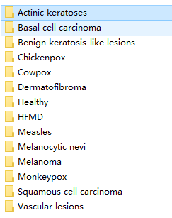
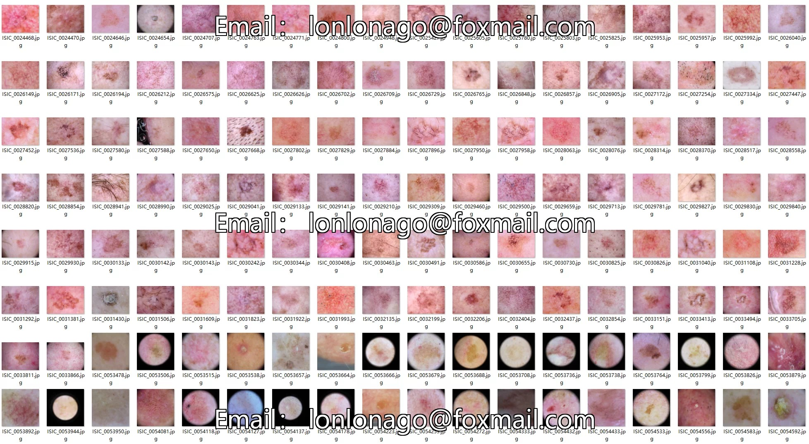
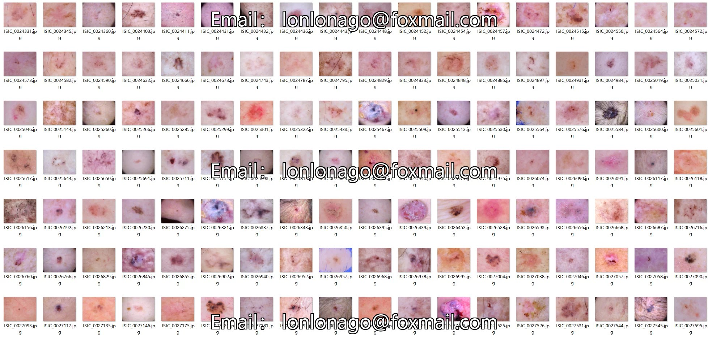
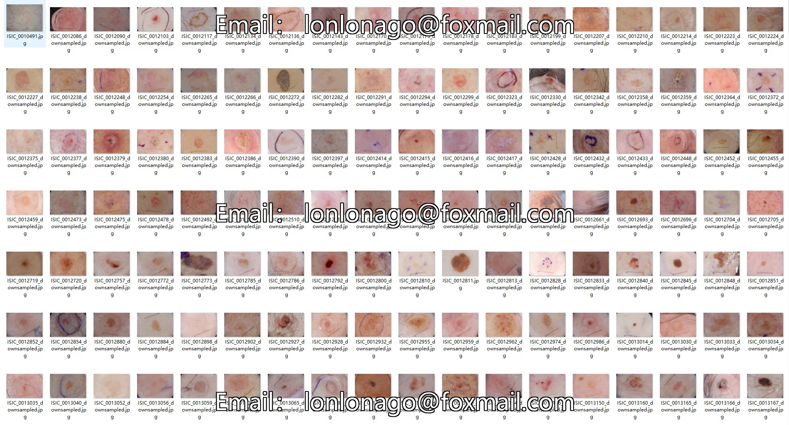
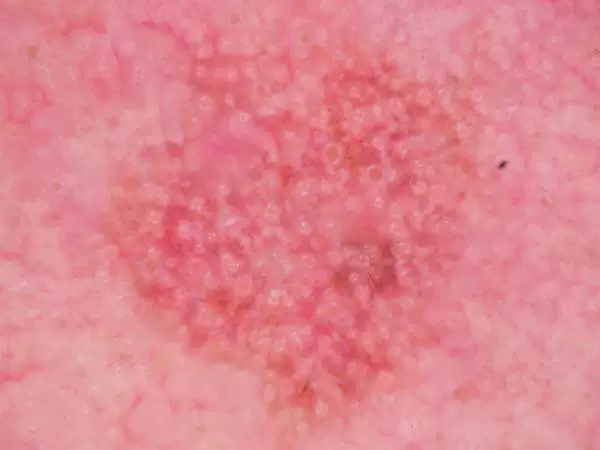

## Body

Skin Lesion Classification Dataset (14 Classes)

This dataset contains 14 types of skin lesion classification, including the merge of HAM10000 (2019) and MSLDv2.0.

Training set: 29322 images    Test set: 3674 images     Validation set: 3660    Total approximately 10GB

The dataset includes 14 categories:
-------Radiant Keratinase
-------Basal Cell Carcinoma
-------Benign Keratinizing Lesion
-------Varicella
-------Smallpox
-------Fibroma
-------Healthy
-------Hand-foot-and-Mouth Disease
-------Measles
-------Melanocytic Nevus
-------Melanoma
-------Monkeypox
-------Squamous Cell Carcinoma
-------Vasculitis

## Images

item_1049810801277

Here is a pay link on Stripe ( https://buy.stripe.com/3cs8yP7sY87d0vu9AB ). Please contact me lonlonago@foxmail.com after funding $89, and I will send you a complete data files , thank you!

